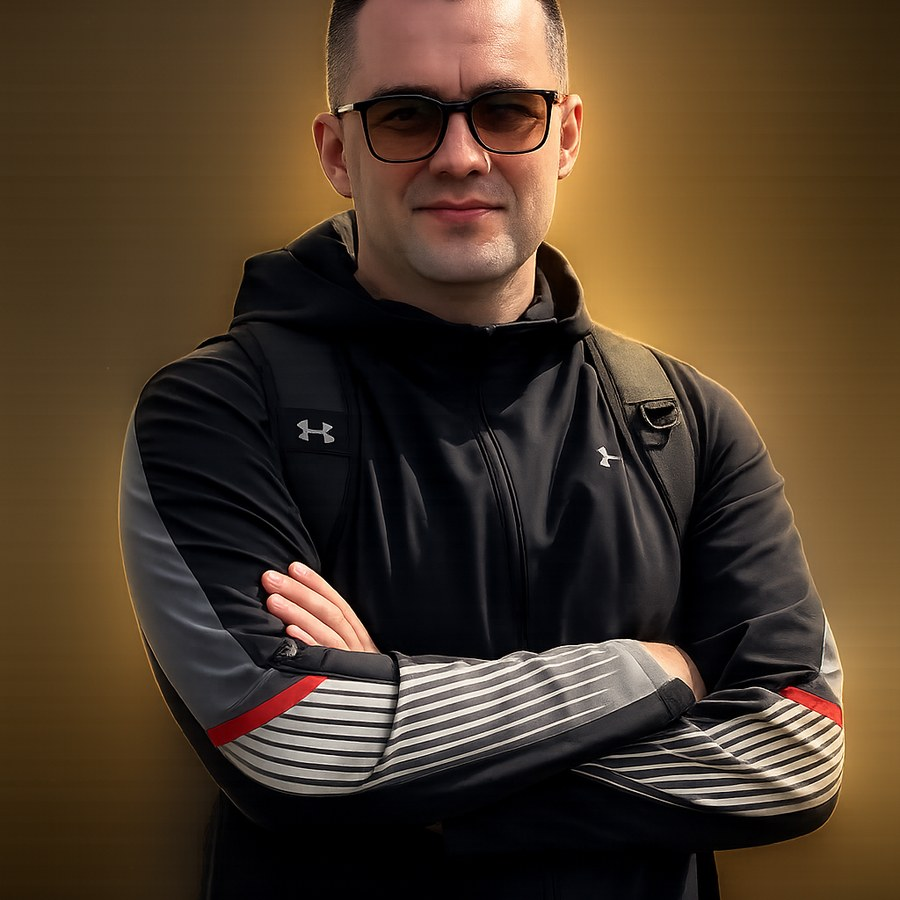

# Портфоліо — інструкція із запуску

## 1. Налаштований домен

Сайт налаштований під **`https://www.okdev.win`** (канонічний URL).

- Домен, SEO, sitemap, контакти — уже оновлені
- Залишилось: `assets/photo.jpg`, `og-image.png`, URL Worker у `assets/config.js`
- GitHub: `https://github.com/cayz696/okdev-win`

## 2. Cloudflare: сайт і Worker — це не одне й те саме

**Cloudflare** — платформа. У проєкті два сервіси:

| Що | Де живе | Для чого |
|----|---------|----------|
| **Cloudflare Pages** | `www.okdev.win` | Статичний сайт (HTML/CSS/JS) |
| **Cloudflare Worker** | `*.workers.dev` | API: форма → Telegram, блог, картинки |

Один акаунт Cloudflare, але **два окремі деплої**. Повна інструкція: `worker/README.md`.

### Швидкий старт

1. **Pages** — залий сайт, прив'яжи домен `www.okdev.win` (і редірект з `okdev.win`)
2. **Worker** — `cd worker && wrangler deploy` (KV + secrets)
3. Встав URL Worker у `assets/config.js` → `workerUrl`
4. Секрети (`TELEGRAM_BOT_TOKEN`, `TELEGRAM_CHAT_ID`, `PUBLISH_SECRET`) — **тільки** через `wrangler secret put`, ніколи в git

Токен бота для форми живе тільки на Cloudflare і не потрапляє в код сторінки.
Для публікації блогу — **окремий** Telegram-бот на VPS (`bot/publish_bot.py`).

## 3. Розміщення на хостингу

Сайт повністю статичний (HTML/CSS/JS, без збірки) — підходить будь-який
статичний хостинг:

- **Netlify / Vercel / Cloudflare Pages** — просто перетягни папку `portfolio`
  або підключи Git-репозиторій.
- **GitHub Pages** — заливаєш вміст папки в репозиторій, вмикаєш Pages в
  налаштуваннях.
- Файл `en/index.html` автоматично стане доступним за адресою `твійдомен.com/en/`.

## 4. Google Analytics + Search Console

**Google Analytics (GA4):**
1. Створи ресурс на analytics.google.com, отримай Measurement ID (виду `G-XXXXXXX`).
2. Перед закриваючим тегом `</head>` в обох файлах (`index.html`, `en/index.html`)
   встав стандартний код GA4 зі своїм ID (Google видає його автоматично при
   створенні ресурсу — просто скопіюй у обидва файли).

**Google Search Console:**
1. Додай сайт (search.google.com/search-console) через "Domain" або "URL prefix".
2. Підтверди права одним із способів Google (HTML-файл, DNS TXT-запис або
   через сам GA4, якщо вже підключений).
3. Після підтвердження надішли `sitemap.xml` у розділі Sitemaps
   (`твійдомен.com/sitemap.xml`).

## 5. SEO, що вже закладено в сайт

- Унікальні `<title>` та `<meta description>` з ключовими запитами для UA/EN.
- `hreflang` теги між українською та англійською версіями (Google коректно
  показуватиме потрібну мову в різних країнах).
- Structured data (JSON-LD, `ProfessionalService`) з переліком міст України
  (Київ, Львів, Одеса, Харків, Дніпро, Запоріжжя, Вінниця) для локального SEO.
- `sitemap.xml` і `robots.txt`.
- Семантична структура (`header/main/section/footer`, один `<h1>` на сторінку).

**Ключові запити, під які написано контент:**
UA: замовити бота, розробка telegram ботів, бот на замовлення, автоматизація
бізнес процесів, crm бот, бот для магазину, розробник ботів україна,
дашборд для бізнесу.
EN: hire telegram bot developer, custom bot development, business process
automation, buy a telegram bot, crm automation bot, freelance automation
developer ukraine.

Коли з'являться перші клієнти з конкретних міст або ніш (наприклад "бот для
інтернет-магазину", "бот для стоматології") — варто буде додати під це
окремі короткі блоки тексту чи навіть окремі підсторінки, це підсилить позиції
в пошуку набагато сильніше, ніж просто перелік ключів.

## 6. Що ще варто доробити самостійно

- **Відгуки клієнтів**: у секції "Відгуки" зараз заглушка — додай реальні
  цитати від клієнтів, коли з'являться перші завершені проєкти.
- **Цифри/статистика** (роки досвіду, кількість проєктів) — свідомо не
  додавав вигаданих цифр; якщо хочеш конкретні показники в hero/about —
  скажи, і я їх впишу.
- **Фото** — у hero-блоці вже є кругла рамка з амбер-підсвіткою (glow ring),
  зараз там заглушка-іконка. Анімована SVG-схема бота перенесена в секцію
  "Як ми працюємо", де вона тематично доречніша.

  Щоб поставити фото:
  1. Поклади файл як `assets/photo.jpg` (або `.png`).
  2. У `index.html` та `en/index.html` знайди коментар `<!-- Постав своє
     фото сюди -->` у hero-блоці, додай `` і видали `
...
`.

  **Формат:** квадратне кадрування (1:1), мінімум 1000×1000px, JPG або PNG.
  Кругла рамка обрізає фото по колу (`object-fit: cover`), тож найважливіше
  — обличчя по центру кадру. Амбер-кільце та розмитий глов накладаються
  поверх через CSS (не потрібно вбудовувати ефект у сам файл) — але фото
  на темному або нейтральному фоні виглядатиме природніше, ніж на світлому.

  **Якщо хочеш згенерувати/стилізувати фото через Nano Banana (Gemini
  image generation)**, ось промпт під стиль сайту (додай свою фотографію
  як референс, якщо генеруєш на її основі):

  > Professional portrait photo of a male software developer, upper body,
  > arms crossed, confident calm expression, looking at camera. Studio
  > lighting with a warm amber rim light on one side and a subtle teal/cyan
  > accent light on the other. Background: deep near-black (#0b0e11),
  > softly blurred, no clutter. Sharp focus on face, shallow depth of
  > field. Modern tech/SaaS aesthetic, cinematic, high-end, photorealistic,
  > square 1:1 crop, centered composition.

  Онови також `alt`-текст на реальне ім'я/роль, якщо ще не зроблено.
